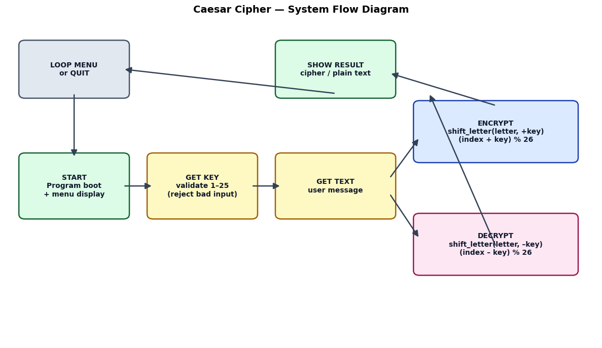
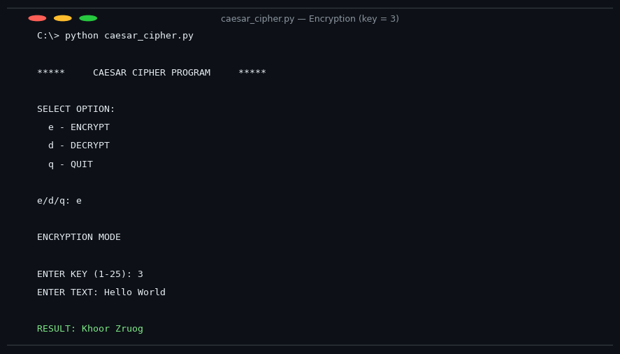
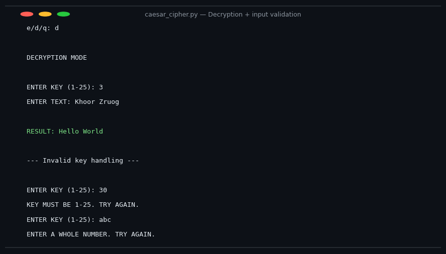

# Caesar Cipher Project — Report

**Name:** Gaurav &nbsp;|&nbsp; **Roll No:** 04719051725 &nbsp;|&nbsp; **Batch:** B1 &nbsp;|&nbsp; **Course:** IIOT (2nd Year)

---

## 1. Overview

### What & Why
I built a **Caesar Cipher program in Python** that can encrypt and decrypt any text by shifting each letter by a chosen key (1–25). I chose this project because cryptography is the foundation of modern security (banking, WhatsApp, passwords), and the Caesar cipher is the perfect first step into understanding how encryption actually works — simple enough to build from scratch, yet it introduces the core ideas of keys, modular arithmetic, and cipher algorithms.

### Expected Outcome
- A working program that encrypts and decrypts text correctly for any valid key.
- Input validation so the program never crashes on bad input.
- A clean menu-driven interface that anyone can run without setup.

---

## 2. Requirements

### Hardware
| Component | Qty | Purpose |
|---|---|---|
| Laptop / PC | 1 | Running and testing the program |
| (Any standard computer is sufficient — no special hardware needed) | | |

### Software
| Tool / Library | Version | Purpose |
|---|---|---|
| Python | 3.x | Core programming language |
| VS Code / any editor | — | Writing the code |
| Git & GitHub | — | Version control and submission |

**Constraints:** No budget required; only constraint was time — the project was completed within the assigned lab schedule using only built-in Python features (no external libraries).

---

## 3. Design

### System Overview
```
User Input (text + key)  →  Validate Key (1–25)  →  Shift Each Letter  →  Output (cipher/plain text)
```
1. The program displays a menu: **ENCRYPT / DECRYPT / QUIT**.
2. The user enters a key; the program loops until a valid number from 1–25 is given.
3. Each letter is shifted using `(index ± key) % 26` — the modulo keeps the shift inside the alphabet.
4. Uppercase stays uppercase, lowercase stays lowercase; spaces, numbers, and punctuation pass through unchanged.
5. The result is printed and the menu repeats until the user quits.

### System Diagram
```
+------------+     +-----------+     +----------------+     +-------------+
|   Menu     | --> | Get Key   | --> | Encrypt/Decrypt| --> |  Show Result|
| (e / d / q)|     | (1–25)    |     | (shift letters)|     |             |
+------------+     +-----------+     +----------------+     +-------------+
```



### Key Decisions
| Decision | Chosen | Rejected | Why |
|---|---|---|---|
| Letter shifting | Helper function `shift_letter()` | Duplicated code in Encrypt and Decrypt | One function = less code, easier to fix |
| Alphabet handling | `% 26` modular arithmetic | If-statements for wrap-around | Shorter and mathematically clean |
| Case handling | Preserve original case (H→K, h→k) | Force everything to lowercase | Output looks natural and round-trip is lossless |
| Input safety | `try/except` loop for the key | Single input attempt | Program never crashes on wrong input |

---

## 4. Implementation

The core algorithm is the modular shift:

```python
new_index = (index + key) % 26   # 26 letters, wraps z → a
```

- **Encryption** calls `shift_letter(letter, key)` — shifts forward.
- **Decryption** calls `shift_letter(letter, -key)` — shifts backward (reusing the same function).
- **Case preservation:** the helper detects uppercase letters, converts them back after shifting.
- **Input validation:** `get_key()` loops with `try/except` until a valid integer in range is entered.

**Source file:** [`src/caesar_cipher.py`](./src/caesar_cipher.py)

*This project was learned from the YouTube channel **Fabio Mussani** — https://youtu.be/QYng_rXg5OQ*

---

## 5. Demonstration

**Test 1 — Encryption (key = 3):**
```
ENTER TEXT: Hello World
RESULT: Khoor Zruog
```
**Test 2 — Decryption (key = 3):**
```
ENTER TEXT: Khoor Zruog
RESULT: Hello World
```
**Test 3 — Invalid key handling:**
```
ENTER KEY (1-25): 30
KEY MUST BE 1-25. TRY AGAIN.
ENTER KEY (1-25): abc
ENTER A WHOLE NUMBER. TRY AGAIN.
```

**Screenshots:**

| Encryption (key = 3) | Decryption + input validation |
|---|---|
|  |  |

📹 Screen recording of the full run: see [`media/demo_transcript.txt`](./media/demo_transcript.txt) (full recorded session) and the screenshots below.

---

## 6. Final Result

### Working
- [x] Encrypts any text with a user-selected key (1–25)
- [x] Decrypts back to the exact original text, including uppercase letters
- [x] Input validation — never crashes on wrong input
- [x] Repeatable menu loop — encrypt/decrypt multiple times without restarting

### Known Issues
- Only English letters (a–z) are encrypted; numbers and symbols pass through as-is
- The Caesar cipher is easily broken by brute force (only 25 possible keys)

**Demo:** [Recorded session](media/demo_transcript.txt) &nbsp;|&nbsp; **Automated tests:** `python -m unittest discover tests -v` (12 tests, all passing)

---

## 7. Limitations & Improvements

**Limitations:**
- 25 possible keys means it offers zero real security — it's a learning tool, not real encryption.
- No file input/output; text must be typed manually.

**Next Steps (with more time):**
- Add a **brute-force mode** that tries all 25 keys at once
- Add **file encryption** (.txt input/output)
- Extend to a **Vigenère cipher** (multiple keys) for a stronger challenge

---

## 8. Key Learnings

- **Modular arithmetic (`% 26`)** is the elegant way to handle alphabet wrap-around — no messy if-statements needed.
- **Reusing code matters:** writing `shift_letter()` once and calling it from both Encrypt and Decrypt made debugging far easier.
- **Defensive programming:** the `try/except` loop taught me that real users *will* enter wrong input — a program must handle it gracefully.
- **Case-preservation bug:** I learned that checking `letter in alphabet` silently skips uppercase letters — the fix (`letter.lower() in alphabet`) taught me to test edge cases like capital letters.

---

## 9. Repository Structure

```
gaurav/
├── README.md                    (this report)
├── src/
│   └── caesar_cipher.py         (main program)
├── tests/
│   └── test_caesar.py           (12 automated tests — all passing)
├── docs/
│   └── images/
│       ├── system_diagram.png       (flowchart of the program)
│       ├── screenshot_encrypt.png   (encryption run)
│       └── screenshot_decrypt.png   (decryption + validation run)
├── hardware/
│   └── README.md                (system requirements — software-only project)
└── media/
    └── demo_transcript.txt      (full recorded demo session)
```
