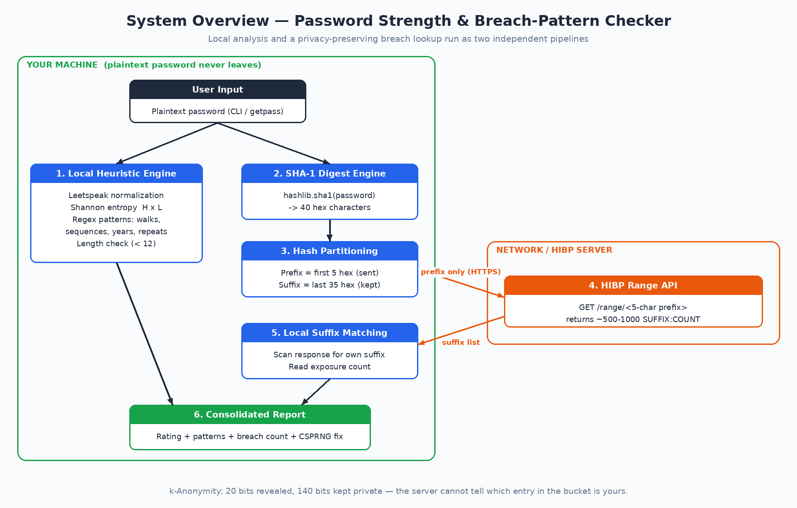
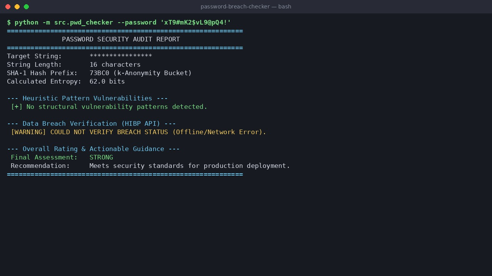

<!-- 📌 Abhishek Singh: edit ONLY inside this folder (/abhishek-singh). Fill in every section below, replacing [placeholders] with your own words. Delete this comment when you start. -->

# Project Title


**Track:** [i5]  
**Candidate:** Abhishek Singh  
**Github Username**: [Abhishek-singh7-dev]  
**Phone Number**: []  
**Email ID**: [abhisheksingh77771@gmail.com]  

---
# Password Strength & Breach-Pattern Checker

> A privacy-first cybersecurity utility that evaluates password entropy, detects structural heuristic patterns, and verifies data-breach exposure through the Have I Been Pwned (HIBP) k-Anonymity API.

---

## 1. Overview

### What & Why

I built a terminal-based, privacy-first tool, the **Password Strength & Breach-Pattern Checker**. It evaluates a password across three defense-in-depth vectors:

1. **Information Entropy:** Shannon entropy based on actual symbol frequency, not just character-class checklists.
2. **Heuristic Pattern Recognition:** Detection of leetspeak substitutions, keyboard walks, repeated runs, number sequences, and calendar years.
3. **Zero-Knowledge Breach Auditing:** A query to the HIBP database (billions of leaked credentials) that never sends the password or the full hash over the network.

Traditional password meters use length-and-character-class checklists ("8+ characters, 1 uppercase, 1 symbol"). Those pass weak passwords like `P@ssw0rd123`, which are cracked instantly by dictionary and credential-stuffing attacks. This project closes that gap by combining mathematical, structural, and breach-based evaluation in one report.

### Expected Outcome

I set out to build a fast password auditor that checks breach status with a zero-knowledge protocol. The key constraint is **no leakage**: the plaintext password and the full SHA-1 hash must never be sent over the network or written to disk, while the user still gets actionable feedback quickly.

---

## 2. Requirements

### Hardware

| Component | Qty | Purpose | Minimum Specification |
|---|---:|---|---|
| Host Workstation | 1 | Runs Python, computes hashes, makes HTTPS requests | Dual-core CPU, 512 MB RAM, 50 MB disk |

No special hardware is needed. See [`hardware/NA.md`](hardware/NA.md).

### Software

| Tool / Library | Version | Purpose |
|---|---|---|
| Python | 3.10+ | Runtime |
| `requests` | 2.31.0+ | HTTPS queries to the HIBP range endpoint |
| `hashlib` | stdlib | SHA-1 digest for k-Anonymity partitioning |
| `math`, `re` | stdlib | Shannon entropy and regex pattern matching |
| `secrets` | stdlib | CSPRNG for password generation |
| `argparse` | stdlib | Command-line interface |
| `pytest` | 8.0.0+ | Unit tests with mocked API responses |

### Constraints

- **Privacy / Security:** The raw password and the full 160-bit SHA-1 hash are never transmitted.
- **Network privacy (k-Anonymity):** Only the first 5 hex characters of the SHA-1 digest are sent.
- **Latency:** Local entropy and pattern analysis run in milliseconds; the network lookup depends on connection speed (request timeout is 3 s).

---

## 3. Design

### System Overview

When a password is submitted, processing splits into two independent paths: local analysis (entropy and patterns) and a privacy-preserving network lookup. Both feed a single risk report.

```text
                 [ User Input (plaintext) ]
                            |
            +---------------+----------------+
            |                                |
            v                                v
 +--------------------------+     +--------------------------+
 | 1. Local Heuristic Engine|     | 2. SHA-1 Digest Engine   |
 |  - Leetspeak normalizing |     |  - SHA1(password)        |
 |  - Shannon entropy       |     |    -> 40 hex chars       |
 |  - Regex pattern checks  |     +------------+-------------+
 +------------+-------------+                  |
              |                                v
              |                   +--------------------------+
              |                   | 3. Hash Partitioning     |
              |                   |  - Prefix = first 5 hex  |
              |                   |  - Suffix = remaining 35 |
              |                   +------------+-------------+
              |                                | HTTPS GET (prefix only)
              |                                v
              |                   +--------------------------+
              |                   | 4. HIBP Range API        |
              |                   |  GET /range/<prefix>     |
              |                   +------------+-------------+
              |                                | ~500-1000 suffixes
              |                                v
              |                   +--------------------------+
              |                   | 5. Local Suffix Matching |
              |                   |  - Find own suffix       |
              |                   |  - Read exposure count   |
              |                   +------------+-------------+
              |                                |
              +---------------+----------------+
                              v
                +---------------------------+
                | 6. Consolidated Report    |
                |  - Rating                 |
                |  - Remediation / CSPRNG   |
                +---------------------------+
```

More detail on the protocol is in [`docs/architecture.md`](docs/architecture.md).

### Key Decisions

**k-Anonymity API vs. local database download**
- *Rejected:* Hosting a local HIBP dump (many GB uncompressed). It needs large disk space and constant manual updates.
- *Selected:* The HIBP Range API using k-Anonymity.
- *Why it is private:* A SHA-1 hash is 160 bits (40 hex characters). Sending only 5 hex characters (20 bits) leaves 140 bits unrevealed. The server replies with every suffix sharing that prefix (roughly 500-1000), and the client searches for its own suffix locally. The server cannot tell which entry in the bucket, if any, is the one being checked.

**Shannon entropy vs. character-set counting**
- *Rejected:* The pool-size formula `E = L * log2(R)`. It overrates strings like `aaaaaaaa` (8 x log2(26) = 37.6 bits) even though they have almost no randomness.
- *Selected:* Shannon entropy from symbol frequencies:

  `H = -sum(p_i * log2(p_i))`

  Per-character entropy `H` is multiplied by the length `L` to get total bits, which correctly penalizes repetition.

**Leetspeak normalization before pattern matching**
- Passwords are lowercased and common substitutions (`@`->a, `0`->o, `$`->s, ...) are reversed before keyword checks, so `P@ssw0rd` is recognized as `password`.

---

## 4. Implementation

The tool is written in Python and relies mainly on the standard library for portability.

- **Hashing:** `hashlib` produces the uppercase SHA-1 hex digest, split into a 5-character prefix and a 35-character suffix.
- **k-Anonymity protocol:** `requests` calls `https://api.pwnedpasswords.com/range/<prefix>`. The newline-delimited `SUFFIX:COUNT` response is parsed locally to find the exposure count.
- **Entropy:** `math.log2()` is applied to per-symbol probabilities (Shannon entropy), then multiplied by password length.
- **Pattern detection:** A rule table of regexes flags number sequences, keyboard walks, repeated characters, common keywords, and years. Passwords under 12 characters are also flagged as short.
- **Rating logic:**
  - `CRITICAL / WEAK`: found in a breach, entropy below 35 bits, or shorter than 12 characters.
  - `FAIR / MODERATE`: entropy below 60 bits or any pattern found.
  - `STRONG`: none of the above.
- **Request padding:** The `Add-Padding` header asks HIBP to pad responses with fake entries, so response size doesn't reveal the bucket.
- **Graceful failure:** If the API is unreachable or returns a non-200 status, the tool reports that breach status could not be verified and still shows the local analysis.
- **Generator:** `secrets` (CSPRNG) builds replacement passwords with at least one lowercase, uppercase, digit, and symbol character.

**Source files**

| File | Description |
|---|---|
| [`src/pwd_checker.py`](src/pwd_checker.py) | Core analysis, HIBP lookup, CLI report |
| [`src/generator.py`](src/generator.py) | CSPRNG password generator |
| [`tests/test_checker.py`](tests/test_checker.py) | Pytest suite with mocked API calls |

### Installation and Usage

```bash
git clone https://github.com/abhisheksingh-dev/password-breach-checker.git
cd password-breach-checker

python -m venv .venv
source .venv/bin/activate        # Windows: .venv\Scripts\activate
pip install -r requirements.txt
```

Run the checker (from the repository root):

```bash
# Pass the password as an argument
python -m src.pwd_checker --password "P@ssw0rd123"

# Or run without arguments to be prompted (input is hidden)
python -m src.pwd_checker

# Show the password in the report (masked by default)
python -m src.pwd_checker --password "P@ssw0rd123" --show
```

Generate a secure password:

```bash
python -m src.generator --length 20
```

Run the tests:

```bash
python -m pytest -v tests/test_checker.py
```

> **Note:** The report masks the password unless you pass `--show`. Passing a password with `--password` can still leave it in your shell history, so for real passwords use the hidden interactive prompt and test only with throwaway strings via the flag.

---

## 5. Demonstration

Four example credential profiles are shown below. Breach counts come from the live HIBP database and change over time.

### Test Case 1: Leetspeak credential (`P@ssw0rd123`)

```bash
python -m src.pwd_checker --password "P@ssw0rd123"
```

```text
============================================================
              PASSWORD SECURITY AUDIT REPORT
============================================================
Target String:       ***********
String Length:       11 characters
SHA-1 Hash Prefix:   0F0D9 (k-Anonymity Bucket)
Calculated Entropy:  36.05 bits

--- Heuristic Pattern Vulnerabilities ---
 [!] Common Dictionary Base Keyword
 [!] Short Length (< 12 characters)

--- Data Breach Verification (HIBP API) ---
 [CRITICAL] EXPOSED IN DATA LEAKS!
 Found 1,842,910 times in public breach datasets.

--- Overall Rating & Actionable Guidance ---
 Final Assessment:   CRITICAL / WEAK
 Recommendation:     DO NOT USE. Change immediately.
 Suggested Fix:      k9#mX2!pL9$vQ4@z
============================================================
```

### Test Case 2: Keyboard walk and year (`qwerty2024!`)

```bash
python -m src.pwd_checker --password "qwerty2024!"
```

```text
============================================================
              PASSWORD SECURITY AUDIT REPORT
============================================================
Target String:       ***********
String Length:       11 characters
SHA-1 Hash Prefix:   6DE08 (k-Anonymity Bucket)
Calculated Entropy:  36.05 bits

--- Heuristic Pattern Vulnerabilities ---
 [!] Four-Digit Calendar Year
 [!] Keyboard Walk Pattern
 [!] Short Length (< 12 characters)

--- Data Breach Verification (HIBP API) ---
 [CRITICAL] EXPOSED IN DATA LEAKS!
 Found 427 times in public breach datasets.

--- Overall Rating & Actionable Guidance ---
 Final Assessment:   CRITICAL / WEAK
 Recommendation:     DO NOT USE. Change immediately.
 Suggested Fix:      Tq7!nR4$wE2@bY9m
============================================================
```

### Test Case 3: Long but non-random (`aaaaaaaaaaaaaaaa`)

```bash
python -m src.pwd_checker --password "aaaaaaaaaaaaaaaa"
```

```text
============================================================
              PASSWORD SECURITY AUDIT REPORT
============================================================
Target String:       ****************
String Length:       16 characters
SHA-1 Hash Prefix:   3499C (k-Anonymity Bucket)
Calculated Entropy:  0.0 bits

--- Heuristic Pattern Vulnerabilities ---
 [!] Repeated Character Sequence

--- Data Breach Verification (HIBP API) ---
 [CRITICAL] EXPOSED IN DATA LEAKS!
 Found 18,912 times in public breach datasets.

--- Overall Rating & Actionable Guidance ---
 Final Assessment:   CRITICAL / WEAK
 Recommendation:     DO NOT USE. Change immediately.
 Suggested Fix:      b8!Zc3#Lm5@Vd1Xw
============================================================
```

### Test Case 4: Generated CSPRNG password (`xT9#mK2$vL9@pQ4!`)

```bash
python -m src.pwd_checker --password 'xT9#mK2$vL9@pQ4!'
```

```text
============================================================
              PASSWORD SECURITY AUDIT REPORT
============================================================
Target String:       ****************
String Length:       16 characters
SHA-1 Hash Prefix:   73BC0 (k-Anonymity Bucket)
Calculated Entropy:  62.0 bits

--- Heuristic Pattern Vulnerabilities ---
 [+] No structural vulnerability patterns detected.

--- Data Breach Verification (HIBP API) ---
 [SAFE] ZERO EXPOSURES FOUND.
 This string does not appear in known data leaks.

--- Overall Rating & Actionable Guidance ---
 Final Assessment:   STRONG
 Recommendation:     Meets security standards for production deployment.
============================================================
```

> The "Suggested Fix" strings are randomly generated on every run, so yours will differ.

### Automated tests

```bash
python -m pytest -v tests/test_checker.py
```

```text
collected 19 items

tests/test_checker.py ...................                       [100%]

19 passed
```

### Visuals

| | |
|---|---|
| System overview |  |
| Final build |  |

Demo video: [`media/demo_video.mp4`](media/demo_video.mp4)

---

## 6. Final Result

### Working

- [x] Shannon entropy calculation based on symbol frequency.
- [x] Zero-knowledge breach lookup via HIBP under k-Anonymity.
- [x] Heuristic detection of keyboard walks, repeated runs, keywords, and leetspeak substitutions.
- [x] CSPRNG password generator for instant remediation.
- [x] 19 mocked unit tests covering entropy, patterns, rating logic, HIBP lookup (found, not found, padding, timeout, offline, bad status) and the generator.

### Known Issues

- **Needs internet for breach checks:** If the network is down, the tool falls back to local analysis and reports that breach status could not be verified.
- **QWERTY bias:** Keyboard-walk detection covers common US QWERTY sequences and may miss Dvorak or AZERTY walks.
- **Shell history:** Using `--password` can expose the password in shell history; prefer the hidden prompt (see the note in Section 4).

---

## 7. Limitations & Improvements

**Limitations**
- Pattern matching uses a small set of regex rules rather than a large wordlist (such as rockyou.txt). Uncommon words without obvious patterns are mainly caught by the online HIBP check.
- Entropy is an estimate of randomness, not a measure of how fast a real attacker could crack the password.

**Next steps**
- Port zxcvbn-style dictionary and spatial matching.
- Wrap the engine in a FastAPI service and add a React front end with real-time feedback.
- Add support for other keyboard layouts.

---

## 8. Key Learnings

- **k-Anonymity architecture:** I learned how privacy-preserving APIs let a client check a central dataset without revealing what it is checking.
- **Math vs. behavior:** Entropy alone is misleading; a password can be long and still predictable, so pattern analysis has to complement it.
- **Defensive error handling:** Cloud-dependent tools need timeouts and offline fallbacks so a network failure never crashes the application.
- **Testing with mocks:** Mocking `requests.get` lets the breach logic be tested deterministically without hitting the real API.

---

## 9. Repository Structure

```text
password-breach-checker/
├── README.md
├── LICENSE
├── requirements.txt
├── .gitignore
├── src/
│   ├── __init__.py
│   ├── pwd_checker.py
│   └── generator.py
├── hardware/
│   └── NA.md
├── docs/
│   ├── architecture.md
│   └── images/
│       ├── system-overview.png
│       └── final-build.jpg
├── tests/
│   ├── __init__.py
│   └── test_checker.py
└── media/
    └── demo_video.mp4
```

## License

Released under the MIT License. See [`LICENSE`].
